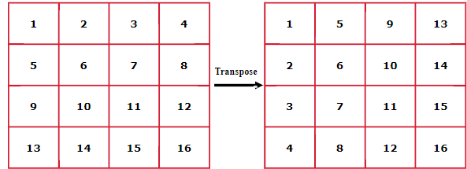

# Arrays Problems

1. Find largest and Second largest element in an array
2. Maximum Index Different
3.  Check if array is sorted and rotated
4. Maximum occured integer in the given range
5. Rearrange Array Alternately
6. First Missing Positive
7. Buy and sell Stock
8. Buy and Sell a Share at most twice
9. Trapping Rain Water
10. Majority Element (moores algorithm)
11. Pascal Triangle
12. Minimum Platforms
13. Set Matrix Zeroes
14. Rotate 2-d matrix by 90 degree
15. print matrix spirally
16. Subarray Sum Equals K
17. Majority Element II
18. 3 sum
19. 3 sum closest
20. 4 sum
21. Largest subarray with 0 sum
22. Count the number of subarrays with given xor K

# Sliding Window problem
* Find Indexes of a subarray with given sum


### Find largest and Second largest element in an array

```text
The naive solution is to sort the array in descending order and then return the 
second element which is not equal to the largest element from the sorted array.
but the time time complexity of the solution would be O(n log n) log n to sort 
the array in descending order and n for iterating the loop.

The better approach is to keep track of the largest and second largest element
 while traversing the array. If an element is greater than the largest element, 
 we update the largest as well as the second largest. Else if an element 
 is smaller than largest but greater than second largest, then we update the
 second largest only.  
 Time Complexity: O(n), where n is the size of input array.
 Auxiliary space: O(1), as no extra space is required.
 
```
```java
 public static ArrayList<Integer> largestAndSecondLargest(int sizeOfArray, int arr[])
    {
        //code here.
        ArrayList<Integer> list = new ArrayList<>();
        int max = Integer.MIN_VALUE;
        int secondMax = Integer.MIN_VALUE;
        
        for(int i=0;i<sizeOfArray;i++){
            if(arr[i]>max){
                secondMax = max;
                max = arr[i];
            } else if(arr[i]>secondMax && arr[i]!=max) {
                secondMax = arr[i];
            }
        }
        
        if(max == secondMax || secondMax==Integer.MIN_VALUE){
            secondMax = -1;
        }
        list.add(max);
        list.add(secondMax);
        return list;
        
    }
```

### Maximum Index Different
```text

Given an array a of n positive integers. The task is to find the 
maximum of j - i subjected to the constraint of a[i] < a[j] and i < j.

Concept : find the min from left, maximum from right and store them in a separate array,
we need to fint the maximum difference of j-i so keep traversing the element of and find the max
tc : O(n)
sc : O(n)
```

```java
  static int maxIndexDiff(int a[], int n) { 
        
        // create two array to store max from right and min from left
        
        int[] maxRight = new int[n];
        int[] minLeft = new int[n];
        
        // start storing elements
        minLeft[0] = a[0];
        for(int i=1;i<n;i++){
            minLeft[i] = Math.min(minLeft[i-1], a[i]);
        }
        maxRight[n-1] = a[n-1];
        for(int i=n-2;i>=0;i--){
            maxRight[i] = Math.max(maxRight[i+1], a[i]);
        }
        // check for maxDiff
        int ans = 0;
        int i=0,j=0;
        while(i<n && j<n){
            if(minLeft[i]<=maxRight[j]){
                ans = Math.max(ans, j-i);
                j++;
            } else  {
                i++;
            }
        }
        
        return ans;
    }
```
### Check if array is sorted and rotated
```text

When the array is sorted and rotated, so in this case when the previous 
element is greater than the current element will occur only once. If 
this occurs zero times or more than one times then the array is not properly sorted and rotated
TC : O(n)
SC : O(1)
```

```java
public boolean check(int[] nums) {
        int count=0;
        for(int i =0;i<nums.length-1;i++){
            if(nums[i] > nums[(i+1)]){
                count++;
            }
        }
        if(count==0 || (count==1 && nums[0]>=nums[nums.length-1])){
            return true;
        }
        return false;      
    }
```
### Maximum occured integer in the given range
````text

Problem : Given two arrays L[] and R[] of size N where L[i] and R[i] (0 ? L[i], R[i] < 106)denotes a range 
of numbers, the task is to find the maximum occurred integer in all the ranges. If more than one such integer 
exists, print the smallest one
A naive approach to solve this problem is create a hashmap with frequencies and find the key corresponding to that value

the efficient solution is use the prefix sum  
````


```java
 public static int maxOccured(int L[], int R[], int n, int maxx) {
    // using prefix sum method
    int[] freq = new int[1000000];

    for (int i = 0; i < n; i++) {
        freq[L[i]] += 1;
        freq[R[i] + 1] -= 1;
    }

    // do the sum of prefix and simultaneously find the max

    int max = 0;
    int index = 0;
    for (int i = 1; i < maxx; i++) {
        freq[i] = freq[i] + freq[i - 1];
        if (freq[i] > max) {
            max = freq[i];
            index = i;
        }

    }
    return index;
}
```
### Rearrange Array Alternately
```text

Given a sorted array of positive integers. Your task is to rearrange the array elements alternatively i.e first element should be max value,
second should be min value, third should be second max, fourth should be second min and so on.
Note: Modify the original array itself. Do it without using any extra space. You do not have to return anything.

Example 1:

Input:
n = 6
arr[] = {1,2,3,4,5,6}
Output: 6 1 5 2 4 3
Explanation: Max element = 6, min = 1, 
second max = 5, second min = 2, and 
so on... Modified array is : 6 1 5 2 4 3.

The naive approach is to create a temporary array, maintain two pointers one for max element and one min elements and keep populating the temp array until all are visited
https://www.interviewbit.com/blog/rearrange-array-alternately/ 
but here TC is O(n) and SC is O(n)
we can optimized the space complexity by following

The pseudo-code for the above-discussed algorithm can be:

1. Initialize two pointers i and j, i will be pointing at the minimum index, and j will be pointing at the maximum index (i.e. n-1).
2. Initialize another variable called greaterMax that will be equal to the 1 + maximum element i.e. 1 + a[j].
3. Traverse the entire input array by performing the following operations:
    - check if the current index is even (divisible by 2), then:
        update a[currentIndex] = a[currentIndex] + (A[j] % greaterMax) * greaterMax
        decrement j by 1 i.e. j--
    - if the current index is odd (not divisible by 2), then:
        update a[currentIndex] = a[currentIndex] + (A[i] % greaterMax) * greaterMax
        increment i by 1 i.e. i++
        
```

````java
  public static void rearrange(long arr[], int n){
        
        int max = n-1;
        int min = 0;
        long gt = arr[max]+1;
        
        for(int i=0;i<n;i++){
            if(i%2==0){
                arr[i] = arr[i] + (arr[max]%gt) * gt;
                max--;
            } else {
                arr[i] = arr[i] + (arr[min]%gt) * gt;
                min++;
            }
        }
        
        for(int i=0;i<n;i++){
            arr[i] /=gt;
        }
        
    }
````
### First Missing Positive
```text
Smallest Positive missing number OR 41. First Missing Positive
Given an unsorted integer array nums. Return the smallest positive integer that is not present in nums.

You must implement an algorithm that runs in O(n) time and uses O(1) auxiliary space.


Input: nums = [1,2,0]
Output: 3
Explanation: The numbers in the range [1,2] are all in the array.
Example 2:

Input: nums = [3,4,-1,1]
Output: 2
Explanation: 1 is in the array but 2 is missing.
Example 3:

Brute force idea is to sort the array and then check for the smallest missing number (start from 1) if it is present then increment it.

https://leetcode.com/problems/first-missing-positive/editorial/

Algorithm
1. Initialize a variable n to the length of nums.
2. Use cycle sort to place positive elements smaller than n at the correct index.

    - Initialize a variable i to 0.
    - Iterate through the elements in nums:
    - Set a variable correctIdx to nums[i] - 1.
    - If the nums[i] is greater than zero, less than or equal to n, and does not equal nums[correctIdx], swap the element at nums[i] with the element at nums[correctIdx].
      Otherwise, increment i.
 3. Iterate through sorted nums and return the smallest missing positive number.

For each element in nums, if nums[i] does not equal i + 1, return i + 1, the smallest missing positive number.
Return n + 1, the smallest missing positive number when each number in nums is in the correct position.

```

````java
 public static int firstMissingPositive(int[] nums,
                                        int n)
{
    Arrays.sort(nums);
    int ans = 1;
    for (int i = 0; i < n; i++) {
        if (nums[i] == ans)
            ans++;
    }
    return ans;
}
//bruce force TC (n log n) and SC O(1)
````

```java
 public int firstMissingPositive(int[] nums) {
        int n = nums.length;
        
        // Use cycle sort to place positive elements smaller than n
        // at the correct index
        int i = 0;
        while (i < n) {
            int correctIdx = nums[i] - 1;
            if (nums[i] > 0 && nums[i] <= n && nums[i] != nums[correctIdx]) {
                swap(nums, i, correctIdx);
            } else {
                i++;
            }
        }

        // Iterate through nums
        // return smallest missing positive integer
        for (i = 0; i < n; i++) {
            if (nums[i] != i + 1) {
                return i + 1;
            }
        }

        // If all elements are at the correct index
        // the smallest missing positive number is n + 1
        return n + 1;
    }

    // Swaps two elements in nums
    private void swap(int[] nums, int index1, int index2) {
        int temp = nums[index1];
        nums[index1] = nums[index2];
        nums[index2] = temp;
    }
```
### Buy and sell Stock
```text
The cost of stock on each day is given in an array A[] of size N. Find all the segments of days on which you buy and sell the stock such that the sum of difference between sell and buy prices is maximized. Each segment consists of indexes of two elements, first is index of day on which you buy stock and second is index of day on which you sell stock.
Note: Since there can be multiple solutions, the driver code will print 1 if your answer is correct, otherwise, it will return 0. In case there's no profit the driver code will print the string "No Profit" for a correct solution.
N = 7
A[] = {100,180,260,310,40,535,695}
Output:
1
Explanation:
One possible solution is (0 3) (4 6)
We can buy stock on day 0,
and sell it on 3rd day, which will 
give us maximum profit. Now, we buy 
stock on day 4 and sell it on day 6.
Your Task:
The task is to complete the function stockBuySell() which takes an array of A[] and N as input parameters and finds the days of buying and selling stock. The function must return a 2D list of integers containing all the buy-sell pairs i.e. the first value of the pair will represent the day on which you buy the stock and the second value represent the day on which you sell that stock. If there is No Profit, return an empty list.


Expected Time Complexity: O(N)
Expected Auxiliary Space: O(N)

idea : 
minus sign denotes stock bought and + denotes stock sold on that day
bought at | Sold at | pair (index of bought at, index of sold at)
100         180       [0, 1]
180         260       [1, 2]
260         310       [2, 3]
40          535       [4, 5]
535         695       [5, 6]

-100+180-180+260-260+310-40+535-535+695
```

```java
 ArrayList<ArrayList<Integer> > stockBuySell(int A[], int n) {
        ArrayList<ArrayList<Integer>> list = new ArrayList<>();
        int purchasePrice = A[0];
        int day = 0;
        for(int i=1;i<n;i++){
            ArrayList<Integer> pair = new ArrayList<>();
            if(A[i]>purchasePrice){
                pair.add(day);
                pair.add(i);
                list.add(pair);
            }
              purchasePrice = A[i];
              day = i;
        }
        
        return list;
    }
```
### Buy and Sell a Share at most twice
```text
Buy and Sell a Share at most twice
In daily share trading, a buyer buys shares in the morning and sells them on the same day. If the trader is allowed to make at most 2 transactions in a day, the second transaction can only start after the first one is complete (buy->sell->buy->sell). The stock prices throughout the day are represented in the form of an array of prices. 

Given an array price of size n, find out the maximum profit that a share trader could have made.

Example 1:

Input:
n = 6
prices[] = {10,22,5,75,65,80}
Output:
87
Explanation:
Trader earns 87 as sum of 12, 75 Buy at 10, sell at 22, Buy at 5 and sell at 80.

Create an array say profit of size n and initialize all its value to 0.
Iterate price[] from right(n-1) to left(0) and update profit[i] such that profit[i] stores maximum profit achievable from one transaction in sub-array price[i..n-1].
Iterate price[] from left to right and update profit[i] such that profit[i] stores maximum profit such that profit[i] contains maximum achievable profit from two transactions in sub-array price[0..i].
After completing the iteration print value of profit[n-1].

TC : O(n)
SC : O(n)
```

```java
 public static int maxProfit(int n, int[] price) {
        // code here

       int[] profits = new int[n];
       int maxPrice = price[n-1];
       for(int i=n-2;i>=0;i--){
           if(maxPrice<price[i]){
               maxPrice = price[i];
           }
           profits[i] = Math.max(profits[i+1], maxPrice - price[i]);
       }

       int minPrice = price[0];
       for(int i=1;i<n;i++){
           if(minPrice>price[i]){
               minPrice = price[i];
           }
           profits[i] = Math.max(profits[i-1], profits[i]+ (price[i]- minPrice));
       }
        return profits[n-1];
    }
```

### Trapping Rain Water
```text
42. Trapping Rain Water
Given n non-negative integers representing an elevation map where the width of each bar is 1, compute how much water it can trap after raining.

Example 1:

Input: height = [0,1,0,2,1,0,1,3,2,1,2,1]
Output: 6
Explanation: The above elevation map (black section) is represented by array [0,1,0,2,1,0,1,3,2,1,2,1]. In this case, 6 units of rain water (blue section) are being trapped.
Example 2:

Input: height = [4,2,0,3,2,5]
Output: 9
 
Idea to use in both brute force and optimal solution is 
1. find left highest bar and right highest bar
2. find the minimum of two as the bar can contain the water of minimum height only
3. while traversing deduct the arr[i] from minimum of left highest bar and right highest bar store in in trappedWater
4. add the trappedwater to result.
 
```
```java
// TC : O(n2)
// SC 0(1)
    static long trappingWater(int arr[], int n) {
        // naive solution
        // find the lb, rb
        // find minimum water level min(lb,rb)
        // find trapped water tw = wl height[i]
        // sum up the trapped water
        int res =0;
        for(int i =1;i<n-1;i++){
            int lb = arr[i];
            // find the greatest left bar on left side
            for(int j =0;j<i;j++){
                if(arr[j]>lb){
                    lb = arr[j];
                }
            }
            // find the greatest right bar on right side
            int rb = arr[i];
            for(int j = i+1;j<n;j++){
                if(arr[j]>rb){
                    rb = arr[j];
                }
            }
            int wl = Math.min(lb, rb);
            int tw = wl-arr[i];
            res += tw;
        }
        return res;
    }
    
// TC : O(n)
// SC 0(n)
static long trap(int arr[], int n){
    int[] left = new int[n];
    int[] right = new int[n];

    left[0] = arr[0];
    for(int i=1; i<n; i++){
        left[i] = Math.max(left[i-1],arr[i]);
    }

    right[n-1] =arr[n-1];
    for(int i=n-2; i>=0; i--){
        right[i] = Math.max(right[i+1],arr[i]);
    }

    long ans = 0;
    for(int i=0; i<n; i++){
        ans += Math.min(left[i],right[i])-arr[i];
    }
    return ans;
}
```
### Largest Sum Contiguous Subarray
```text
Kadane’s Algorithm : Largest Sum Contiguous Subarray
Approach:

The idea of Kadane’s algorithm is to maintain a variable max_ending_here that stores the maximum sum contiguous subarray ending at current index and a variable max_so_far stores the maximum sum of contiguous subarray found so far, Everytime there is a positive-sum value in max_ending_here compare it with max_so_far and update max_so_far if it is greater than max_so_far.

So the main Intuition behind Kadane’s Algorithm is, 

The subarray with negative sum is discarded (by assigning max_ending_here = 0 in code).
We carry subarray till it gives positive sum.

{-2,-3,4,-1,-2,1,5,-3}
```


```java
long maxSubarraySum(int arr[], int n){
        long max_so_far = Integer.MIN_VALUE;
        long max_ending_here = 0;
        for (int i = 0; i < n; i++) {
            max_ending_here = max_ending_here + arr[i];
            if (max_so_far < max_ending_here)
                max_so_far = max_ending_here;
            if (max_ending_here < 0)
                max_ending_here = 0;
        }
        return max_so_far;

    }
```
### Maximum circular subarray sum
```text
Maximum circular subarray sum
Given a circular array of size n, find the maximum subarray sum of the non-empty subarray.

Examples: 

Input: arr[] = {8, -8, 9, -9, 10, -11, 12}
Output: 22 
Explanation: Subarray 12, 8, -8, 9, -9, 10 gives the maximum sum, that is 22.

Input: arr[] = {10, -3, -4, 7, 6, 5, -4, -1} 
Output:  23 
Explanation: Subarray 7, 6, 5, -4, -1, 10 gives the maximum sum, that is 23.

The naive solution is to use two loops to find the maximum sum but TC is O(n*n)
Maximum Circular Subarray Sum using Kadane’s Algorithm:
The idea is to modify Kadane’s algorithm to find a minimum contiguous subarray sum and the maximum contiguous
subarray sum, then check for the maximum value between the max_value and the value left after subtracting min_value
from the total sum.

Follow the steps below to solve the given problem:

We will calculate the total sum of the given array.
We will declare the variable curr_max, max_so_far, curr_min, min_so_far as the first value of the array.
Now we will use Kadane’s Algorithm to find the maximum subarray sum and minimum subarray sum.
Check for all the values in the array:- 
If min_so_far is equaled to sum, i.e. all values are negative, then we return max_so_far.
Else, we will calculate the maximum value of max_so_far and (sum – min_so_far) and return it.
```
```java
static int circularSubarraySum(int a[], int n) {

        //brute
        int res =a[0];
        for(int i=0;i<n;i++){
            int sum =a[i];
            int currentMaxSum = a[i];
            for(int j = 1;j<n;j++){
                int index = (i+j) %n;
                sum += a[index];
                currentMaxSum = Math.max(currentMaxSum, sum);
            }
            res = Math.max(res, currentMaxSum);

        }

        return res;
    }

    
    // TC O(n)
   // SC O(1)
public static int maxCircularSum(int a[], int n)
{

    if (n == 1)
        return a[0];

    int sum = 0;
    for (int i = 0; i < n; i++) {
        sum += a[i];
    }
    int curr_max = a[0], max_so_far = a[0],
            curr_min = a[0], min_so_far = a[0];

    for (int i = 1; i < n; i++)
    {
        curr_max = Math.max(curr_max + a[i], a[i]);
        max_so_far = Math.max(max_so_far, curr_max);

        curr_min = Math.min(curr_min + a[i], a[i]);
        min_so_far = Math.min(min_so_far, curr_min);
    }
    if (min_so_far == sum) {
        return max_so_far;
    }

    return Math.max(max_so_far, sum - min_so_far);
}
```
### Longest Even Odd Subarray
```text
Longest Even Odd Subarray
Problem Statement: Given an array of N integers, find the length of the longest alternating even-odd subarray present in the array.
Example 1:
Input: arr[]={1, 2, 3, 4, 5, 7, 9}
Output: 5
Explanation: The longest subarray with alternate even odd subarray is {1,2,3,4,5}

Example 2:
Input: arr[]={2,3,4,6,10}
Output: 3
Explanation: The longest subarray with alternate even odd subarray is {2,3,4}

Naive Approach:
In this approach, we find the longest even-odd or odd-even subarray for every element and later find the 
maximum length of them.

We iterate through the array and for every element we again iterate through the array to find the subarray size.
Later we find the maximum length 

The following code explains this approach in a better way
Time complexity: O(n^2)

Space complexity: O(1)

Optimal Approach: Simple Mathematics and Kadane’s Algorithm
Everyone knows that the sum of two even/odd numbers is even but the sum of an even and an odd number is odd.

We iterate through the array starting from the 2nd element and check if the sum of the previous element and current element is odd, we increment the size of the subarray, or else we choose the new subarray.

This approach is very similar to our second approach.

The following diagram explains the above approach

https://takeuforward.org/data-structure/longest-even-odd-subarray/
```

```java
// brute
static void evenodd_naive(int arr[]) {
    int ans = 0;
    for (int i = 0; i < arr.length; i++) {
        int count = 1;
        for (int j = i + 1; j < arr.length; j++) {
            if ((arr[j - 1] % 2 == 0 && arr[j] % 2 != 0) || (arr[j - 1] % 2 != 0 && arr[j]
                    % 2 == 0)) {
                count++;
            } else break;
        }
        ans = Math.max(ans, count);
    }

    System.out.println("The length of the longest even-odd subarray is "+ans);
}
// optimal
 static void evenodd_mathKadane(int arr[]) {
     int ans = 0;
     int count = 1;
     for (int i = 1; i < arr.length; i++) {
       if ((arr[i - 1] + arr[i]) % 2 != 0) { // extending the same subarray
         count++;
         ans = Math.max(ans, count);
       } else count = 1; // choosing the new subarray
     }
     System.out.println("The length of the longest even-odd subarray is "+ans);
   }
```

### Majority Element

```text
Naive Approach: 
The basic solution is to have two loops and keep track of the maximum count for all different elements. 
If the maximum count becomes greater than n/2 then break the loops and return the element having the maximum count. If the maximum count doesn’t become more than n/2 then the majority element doesn’t exist.

Moore's Voting Algorithm is an efficient algorithm used to find the majority element in an array, i.e., an element that appears more than N/2 times, where N is the size of the array. 
The algorithm was proposed by Robert S. Moore in 1981.

Here's how Moore's Voting Algorithm works:

* Finding a Potential Candidate:
1. The algorithm iterates through the array, maintaining a candidate variable initialized to the first element of the array.
2. It also maintains a count variable initialized to 1.
3. For each subsequent element in the array, if the element is equal to the current candidate, the count is incremented. Otherwise, the count is decremented.
   - If the count becomes zero, the current element becomes the new candidate, and the count is reset to 1.
   - At the end of this process, the candidate variable holds a potential majority element.
Verifying the Candidate:
- Once a potential candidate is found, the algorithm verifies if it is indeed the majority element by counting its occurrences in the array.
- If the count of the candidate in the array is greater than N/2, where N is the size of the array, then the candidate is considered the majority element.

The key insight behind Moore's Voting Algorithm is that if a majority element exists in the array, it will cancel out the occurrences of all other elements.
As a result, the remaining candidate (if any) after the algorithm completes is likely to be the majority element.

One of the main advantages of Moore's Voting Algorithm is its efficiency, as it requires only a single pass through the array with constant space complexity.
```
```java
static int majorityElement(int a[], int size)
    {
        int element = a[0];
        int count = 1;
        for(int i=1;i<size;i++){
            if(element == a[i]){
                count++;
            } else {
                count--;
                
                if(count == 0){
                    element = a[i];
                    count = 1;
                }
            }
        }   
        count =0;
        for(int i=0;i<size;i++){
            if(a[i]==element){
                count++;
            }
        }
        if(count > size/2){
            return element;
        }
        return -1;
    }
```
### Find Indexes of a subarray with given sum
```text
Given an unsorted array A of size N that contains only non negative integers, find a continuous sub-array that adds to a given number S and return the left and right index(1-based indexing) of that subarray.
In case of multiple subarrays, return the subarray indexes which come first on moving from left to right.
Note:- You have to return an ArrayList consisting of two elements left and right. In case no such subarray exists return an array consisting of element -1.
Example 1:
Input:
N = 5, S = 12 A[] = {1,2,3,7,5} Output: 2 4
Explanation: The sum of elements from 2nd position to 4th position is 12.

Idea :
Naive with O(n*n)
The idea is to consider all subarrays one by one and check the sum of every subarray. Following program implements the given idea. 
Run two loops: the outer loop picks a starting point i and the inner loop tries all subarrays starting from i.
Follow the steps given below to implement the approach:

Traverse the array from start to end.
From every index start another loop from i to the end of the array to get all subarrays starting from i, and keep a variable currentSum to calculate the sum of every subarray.
For every index in inner loop update currentSum = currentSum + arr[j]
If the currentSum is equal to the given sum then print the subarray.

Optimized solution with TC O(n) and SC O(1) using Sliding Window

- Start with an empty subarray 
- add elements to the subarray until the sum is less than x( given sum ). 
- If the sum is greater than x, remove elements from the start of the current subarray.
- Follow the steps given below to implement the approach:

* Create two variables, start=0, currentSum = arr[0]
* Traverse the array from index 1 to end.
* Update the variable currentSum by adding current element, currentSum = currentSum + arr[i]
* If the currentSum is greater than the given sum, update the variable currentSum as currentSum = currentSum – arr[start],
and update start as, start++.
* If the currentSum is equal to given sum, print the subarray and break the loop.

```

```java
static ArrayList<Integer> subarraySum(int[] arr, int n, int sum) {
        ArrayList<Integer> list = new ArrayList<>();
        int currentSum = arr[0], start = 0, i;

        for (i = 1; i <= n; i++) {
            while (currentSum > sum && start < i - 1) {
                currentSum = currentSum - arr[start];
                start++;
            }
            if (currentSum == sum) {
                int p = i - 1;
                list.add(start+1);
                list.add(p+1);
                return list;
            }
            if (i < n)
                currentSum = currentSum + arr[i];
        }

        list.add(-1);
        return list;
    }
```

### Pascal Triangle

```text
1 
1 1 
1 2 1 
1 3 3 1 
1 4 6 4 1 

Intuition: In Pascal's triangle, each element is the sum of the two elements directly above it.
https://www.youtube.com/watch?v=nFqeCXOJn0I
```


```java
   public List<List<Integer>> generate(int numRows) {
        List<List<Integer>> list = new ArrayList<>();
        for(int i=0;i<numRows;i++){
            List<Integer> row = new ArrayList<>();
            for(int j=0;j<=i;j++){
                if(j==0){
                    row.add(1);  // if first element it has to be 1
                } else if(j==i){
                    row.add(1);  // if last element it has to be 1
                } else {
                    // access previous row  in between element are sub of previous numbers
                    List<Integer> prev = list.get(i-1);
                    row.add(prev.get(j-1) + prev.get(j));
                } 
                
            }
            list.add(row);
        } 
        return list;
    }
```

* Minimum Platforms
```text
Given arrival and departure times of all trains that reach a railway station. Find the minimum number of platforms required for the railway station so that no train is kept waiting.
Consider that all the trains arrive on the same day and leave on the same day. Arrival and departure time can never be the same for a train but we can have arrival time of one train equal to departure time of the other. At any given instance of time, same platform can not be used for both departure of a train and arrival of another train. In such cases, we need different platforms.

Examples:

Input: n = 6, arr[] = {0900, 0940, 0950, 1100, 1500, 1800}, 
            dep[] = {0910, 1200, 1120, 1130, 1900, 2000}
Output: 3

```


```java
 static int findPlatform(int arr[], int dep[], int n)
    {
        Arrays.sort(arr);
        Arrays.sort(dep);
        int i=0;
        int j=0;
        int platforms=0;
        int max = 0;
        while(i<n && j<n){
            if(arr[i] <= dep [j]){
                platforms++;
                i++;
            } else {
                platforms--;
                j++;
            }
            if(platforms > max){
                max = platforms;
            }
        }
        return max;
    }
```

* Set Matrix zeroes
```text
Given an m x n integer matrix matrix, if an element is 0, set its entire row and column to 0's.
Example 1:

Input: matrix = [[1,1,1],[1,0,1],[1,1,1]]
Output: [[1,0,1],[0,0,0],[1,0,1]]

Example 2:

Input: matrix = [[0,1,2,0],[3,4,5,2],[1,3,1,5]]
Output: [[0,0,0,0],[0,4,5,0],[0,3,1,0]]

Approach 1
Approach (Using two extra arrays):
The steps are as follows:

First, we will declare two arrays: a row array of size N and a col array of size M and both are initialized with 0.
Then, we will use two loops(nested loops) to traverse all the cells of the matrix.
If any cell (i,j) contains the value 0, we will mark ith index of row array i.e. row[i] and jth index of col array col[j] as 1. It signifies that all the elements in the ith row and jth column will be 0 in the final matrix.
We will perform step 3 for every cell containing 0.
Finally, we will again traverse the entire matrix and we will put 0 into all the cells (i, j) for which either row[i] or col[j] is marked as 1.
Thus we will get our final matrix.

Time Complexity: O(2*(N*M)), where N = no. of rows in the matrix and M = no. of columns in the matrix.
Reason: We are traversing the entire matrix 2 times and each traversal is taking O(N*M) time complexity.

Space Complexity: O(N) + O(M), where N = no. of rows in the matrix and M = no. of columns in the matrix.
Reason: O(N) is for using the row array and O(M) is for using the col array.

Approach 2 : is to use the first row and first column as the temp array to mark the zeroes

The steps are as follows:

First, we will traverse the matrix and mark the proper cells of 1st row and 1st column with 0 accordingly. The marking will be like this: if cell(i, j) contains 0, we will mark the i-th row i.e. matrix[i][0] with 0 and we will mark j-th column i.e. matrix[0][j] with 0.
If i is 0, we will mark matrix[0][0] with 0 but if j is 0, we will mark the col0 variable with 0 instead of marking matrix[0][0] again.
After step 1 is completed, we will modify the cells from (1,1) to (n-1, m-1) using the values from the 1st row, 1st column, and col0 variable.
We will not modify the 1st row and 1st column of the matrix here as the modification of the rest of the matrix(i.e. From (1,1) to (n-1, m-1)) is dependent on that row and column.
Finally, we will change the 1st row and column using the values from matrix[0][0] and col0 variable. Here also we will change the row first and then the column.
If matrix[0][0] = 0, we will change all the elements from the cell (0,1) to (0, m-1), to 0.
If col0 = 0, we will change all the elements from the cell (0,0) to (n-1, 0), to 0.
```


```java
    public static void setZeroesO(int[][] matrix) {
        int rows = matrix.length;
        int cols = matrix[0].length;
        int rowColO = 1;

        for (int i=0; i<rows;i++){
            for(int j=0;j<cols;j++){
                if(matrix[i][j] ==0){
                    matrix[i][0] = 0;
                    if(j==0){
                        rowColO=0;
                    } else {
                        matrix[0][j] = 0;
                    }
                }
            }
        }

        for(int i =1;i<rows;i++){
            for(int j=1;j<cols;j++){
                if (matrix[i][j] != 0) {
                    if (matrix[0][j] == 0 || matrix[i][0] == 0) {
                        matrix[i][j] = 0;
                    }
                }
            }
        }

        if(matrix[0][0] == 0){
            Arrays.fill(matrix[0], 0);
        }
        if(rowColO == 0){
            for (int i=0;i<rows;i++){
                matrix[i][0] = 0;
            }
        }


        for (int i = 0; i < matrix.length; i++) {
            for (int j = 0; j < matrix[0].length; j++) {
                System.out.print(matrix[i][j] + " ");
            }
            System.out.println();
        }

    }
```

14. Rotate 2-d matrix by 90 degree
```text
You are given an n x n 2D matrix representing an image, rotate the image by 90 degrees (clockwise).

You have to rotate the image in-place, which means you have to modify the input 2D matrix directly. DO NOT allocate another 2D matrix and do the rotation.

Example 1:

Input: matrix = [[1,2,3],[4,5,6],[7,8,9]]
Output: [[7,4,1],[8,5,2],[9,6,3]]

Example 2:
Input: matrix = [[5,1,9,11],[2,4,8,10],[13,3,6,7],[15,14,12,16]]
Output: [[15,13,2,5],[14,3,4,1],[12,6,8,9],[16,7,10,11]]
 
```
```text
Brute Force Approach
Approach: Take another dummy matrix of n*n, and then take the first row of the matrix and put it in the last column of the dummy matrix,
take the second row of the matrix, and put it in the second last column of the matrix and so.
```
```java
static int[][] rotate(int[][] matrix) {
        int n = matrix.length;
        int rotated[][] = new int[n][n];
        for (int i = 0; i < n; i++) {
            for (int j = 0; j < n; j++) {
                rotated[j][n - i - 1] = matrix[i][j];
            }
        }
        return rotated;
    }
    
     // TC = SC = O(n*n) 
```

```text
Approach:

Step 1: Transpose the matrix. (transposing means changing columns to rows and rows to columns)
i.e Swap elements across the diagonal
Step 2: Reverse each row of the matrix.

 TC = O(n*n)
 SC = O(1) 
```

```java
  public void rotate(int[][] matrix) {
        // first find tranpose of a matrix 
        int n = matrix.length;
        for(int i =0;i<n;i++){
            for (int j=i+1; j<n;j++){
                int temp = matrix[i][j];
                matrix[i][j] = matrix[j][i];
                matrix[j][i] = temp;
            }
        }
        // then reverse individual rows
        for(int i=0;i<n;i++){
            for(int j=0; j<n/2;j++){
                int temp = matrix[i][j];
                matrix[i][j] = matrix[i][n-1-j];
                matrix[i][n-1-j] = temp;
            }
        }
    }
```

* print matrix spirally 

 ```text
In this approach, we will be using four loops to print all four sides of the matrix.

1st loop: This will print the elements from left to right.

2nd loop: This will print the elements from top to bottom.

3rd loop: This will print the elements from right to left.

4th loop: This will print the elements from bottom to top.

In each outer loop traversal print the elements of a square in a clockwise manner.
Print the top row, i.e. Print the elements of the top row from column index left to right and increase the count of the top so that it will move to the next row.
Print the right column, i.e. Print the rightmost column from row index top to bottom and decrease the count of right.
Print the bottom row, i.e. if top <= bottom, then print the elements of a bottom row from column right to left and decrease the count of bottom
Print the left column, i.e. if left <= right, then print the elements of the left column from the bottom row to the top row and increase the count of left.
Run a loop until all the squares of loops are printed.
```


```java
 public static List<Integer> printSpiral(int[][] mat) {
        
        // Define ans list to store the result.
        List<Integer> ans = new ArrayList<>();
        
        int n = mat.length; // no. of rows
        int m = mat[0].length; // no. of columns
        
        // Initialize the pointers required for traversal.
        int top = 0, left = 0, bottom = n - 1, right = m - 1;

        // Loop until all elements are not traversed.
        while (top <= bottom && left <= right) {

            // For moving left to right
            for (int i = left; i <= right; i++)
                ans.add(mat[top][i]);

            top++;

            // For moving top to bottom.
            for (int i = top; i <= bottom; i++)
                ans.add(mat[i][right]);

            right--;

            // For moving right to left.
            if (top <= bottom) {
                for (int i = right; i >= left; i--)
                    ans.add(mat[bottom][i]);

                bottom--;
            }

            // For moving bottom to top.
            if (left <= right) {
                for (int i = bottom; i >= top; i--)
                    ans.add(mat[i][left]);

                left++;
            }
        }
        return ans;
    }

```

* Subarray Sum Equals K
```text
Given an array of integers nums and an integer k, return the total number of subarrays whose sum equals to k.
A subarray is a contiguous non-empty sequence of elements within an array.

Example 1:

Input: nums = [1,1,1], k = 2
Output: 2
Example 2:

Input: nums = [1,2,3], k = 3
Output: 2

solution
Naive, run two loops and find the sum of each subarray if it is equals to k, if yes and increase the count
TC O(n*n) 
```
```java
 public int subarraySum(int[] nums, int k) {
        int count =0;
        for(int i=0;i<nums.length;i++){
            int sum =0;
            for(int j=i;j<nums.length;j++){
                sum = sum + nums[j];
                if(sum ==k){
                    count++;
                }
            }
        }
        return count;
    }
```
```text
Second optimal solution is to use prefix sum concept
we are going to use the concept of the prefix sum to solve this problem. 
Here, the prefix sum of a subarray ending at index i simply means the sum of all the elements of that subarray.
TC  : O(n)
SP : O(n)
```


```java
public int subarraySum(int[] nums, int k) {
       HashMap<Integer, Integer> map = new HashMap<>();
       int ans=0, sum=0;
       map.put(0,1);

       for(int i=0;i<nums.length;i++){
            sum = sum+nums[i];
            int rsum = sum - k;
            if(map.containsKey(rsum)){
                ans += map.get(rsum);
            }
            map.put(sum, map.getOrDefault(sum, 0)+1);
       }

       return ans;
    }
```
* Majority Element II
```text
Given an integer array of size n, find all elements that appear more than ⌊ n/3 ⌋ times.

A brute force approach is to iterate the array and store frequency of each number in a map 
then traverse the map and find out if the any element appears more than n/3 time
TC and SC O(n)

A optimal solution can be achieved using moores voting algorithm
if size of array is 9, n/3 is 3 so there can be maximum two elements only who could be greater than n/3

so take two candidates and run a loop if they are really appearing n/3 times
TC O(n) and SC O(1)
```

```java
 public List<Integer> majorityElement(int[] nums) {
        ArrayList<Integer> list  = new ArrayList<>();
        int count1 =0, count2=0;
        int firstM = Integer.MAX_VALUE;
        int secondM = Integer.MIN_VALUE;
        int n = nums.length;

        for(int i=0;i<n;i++){
            if(firstM == nums[i]){
                count1++;
            } else if (secondM == nums[i]){
                count2++;
            } else if (count1==0){
                count1++;
                firstM=nums[i];
            } else if (count2==0){
                count2++;
                secondM=nums[i];
            } else {
                count1--;
                count2--;
            }
        }

        count1 =0;
        count2 =0;
         for(int i=0;i<n;i++){
            if(firstM == nums[i]){
                count1++;
            }
            if(secondM == nums[i]){
                count2++;
            }
         }
         if(count1 > n/3){
            list.add(firstM);
         }
         if(count2 > n/3){
            list.add(secondM);
         }
        return list;
    }
```

* 3 sum
```text
Given an integer array nums, return all the triplets [nums[i], nums[j], nums[k]] such that i != j, i != k, and j != k, and nums[i] + nums[j] + nums[k] == 0.
Notice that the solution set must not contain duplicate triplets.

The naive approach with TC of O(n*n*n) is to run 3 loop sum the elements and check if they are equal to 0
 Set<List<Integer>> st = new HashSet<>();
for (int i = 0; i < n; i++) {
            for (int j = i + 1; j < n; j++) {
                for (int k = j + 1; k < n; k++) {
                    if (arr[i] + arr[j] + arr[k] == 0) {
                        List<Integer> temp = Arrays.asList(arr[i], arr[j], arr[k]);
                        temp.sort(null);
                        st.add(temp);
                    }
                }
            }
        }
        
optimal solution is to use two pointer approach of 2 sum solution and run a loop to to pick an element to sum them up with elements at two pointer
check if the sum is equal to 0 if not move left and right pointer accordingly
Time Complexity: O(NlogN)+O(N2), where N = size of the array.        
```

```java
    public List<List<Integer>> threeSum(int[] nums) {
        if(nums==null || nums.length < 3){
            return new ArrayList<>();
        } 
        Set<List<Integer>> set = new HashSet<>();
        Arrays.sort(nums);
        int n = nums.length;
        for(int i=0;i<n;i++){
            if(i>0 && nums[i] == nums[i-1]){
                continue;
            }]
            int left = i+1;
            int right = n-1;
            while(left < right){
                int sum = nums[i] + nums[left] + nums [right];
    
                if(sum == 0){
                    set.add(Arrays.asList(nums[i], nums[left], nums[right]));
                    left ++;
                    right --;
                } else if (sum < 0){
                    left ++;
                } else {
                    right --;
                }
                
            }
        }
        return new ArrayList<>(set);
    }
```

* 3 sum closest
```text
Given an integer array nums of length n and an integer target, find three integers in nums such that the sum is closest to target.

Return the sum of the three integers.

You may assume that each input would have exactly one solution.

This is an extension of 3 sum problem here along with the above solution, we need to check the minimum difference between the target sum 
and sum of the elements
TC : O(n*n) 
```
````java
 public int threeSumClosest(int[] nums, int target) {
        int result = nums[0] + nums[1] + nums [2];
        int minDiff = Integer.MAX_VALUE;
        Arrays.sort(nums);
        int n = nums.length;
        for(int i=0; i<n;i++){
            int left = i+1;
            int right = n-1;

            while(left<right){
                int sum = nums[i] + nums[left] + nums[right];
                if(sum == target){
                    return target;
                } else if (sum < target){
                    left ++;
                } else {
                    right--;
                }

                int diff = Math.abs(target - sum);
                if(diff < minDiff){
                    minDiff = diff;
                    result = sum;
                }

            }
        }
        return result;
    }
````
* 4 sum
```text
Given an array nums of n integers, return an array of all the unique quadruplets [nums[a], nums[b], nums[c], nums[d]] such that:

0 <= a, b, c, d < n
a, b, c, and d are distinct.
nums[a] + nums[b] + nums[c] + nums[d] == target
You may return the answer in any order.

The naive approach is to run 4 loops with TC of O(n*n*n*)

```
```java
public static List<List<Integer>> fourSum(int[] nums, int target) {
    int n = nums.length; // size of the array
    Set<List<Integer>> set = new HashSet<>();

    // checking all possible quadruplets:
    for (int i = 0; i < n; i++) {
        for (int j = i + 1; j < n; j++) {
            for (int k = j + 1; k < n; k++) {
                for (int l = k + 1; l < n; l++) {
                    // taking bigger data type
                    // to avoid integer overflow:
                    long sum = (long)nums[i] + nums[j];
                    sum += nums[k];
                    sum += nums[l];

                    if (sum == target) {
                        List<Integer> temp = Arrays.asList(nums[i], nums[j], nums[k], nums[l]);
                        Collections.sort(temp);
                        set.add(temp);
                    }
                }
            }
        }
    }
    List<List<Integer>> ans = new ArrayList<>(set);
    return ans;
}
```
```java
// optimal approach uses TC of O(n*n*n) with the solution of 2 sum and 3 sum
public List<List<Integer>> fourSum(int[] nums, int target) {
    List<List<Integer>> result = new ArrayList<>();
    if(nums==null || nums.length<4) return result;
    int n = nums.length;
    Arrays.sort(nums);
    for(int i=0;i<n;i++){
        // to skip duplicates
        if(i>0 && nums[i]==nums[i-1]) continue;

        for(int j=i+1;j<n;j++){
            // to skip duplicates
            if(j > i+1 && (nums[j]== nums[j-1])) continue;

            int left = j+1;
            int right = n-1;

            while(left < right) {
                long sum = nums[i] + nums[j] ;
                sum +=nums[left];
                sum +=nums[right];
                if(sum == target) {
                    result.add(Arrays.asList(nums[i], nums[j], nums[left], nums[right]));
                    left++;
                    right--;

                    while(left < right && nums[left] == nums[left-1]) left++;
                    while(left < right && nums[right] == nums[right+1]) right--;

                } else if(sum < target) {
                    left++;
                } else {
                    right--;
                }
            }
        }

    }

    return result;
}

```

* Largest subarray with 0 sum
```text
Given an array having both positive and negative integers. The task is to compute the length of the largest subarray with sum 0.

Examples:

Input: arr[] = {15,-2,2,-8,1,7,10,23}, n = 8
Output: 5
Explanation: The largest subarray with sum 0 is -2 2 -8 1 7.

Brute force solution is to run two loops and check if the sum of the subarray is 0 if yes, calculate the length ( O(n*n))
```

```java
    int maxLen(int arr[], int n) {
        // brute force solution
        int max = 0;
        for (int i = 0; i < n; i++) {
            int sum = 0;
            for (int j = i; j < n; j++) {
                sum = sum + arr[j];
                if(sum ==0){
                    max = Math.max(max, j-i+1);
                }
            }
        }
        return max;
    }
```
```text
Optimal solution is to use concept of the prefix sum 
The problem of finding the largest subarray with a sum of 0 can be solved using a hash map The logic behind the solution involves keeping track of the cumulative sum of elements as we traverse the array
TC (n)
SC (n)
```

```java
  int maxLenO(int arr[], int n) {
        // optimal solution
        int max = 0;
        int currSum = 0;
        HashMap<Integer,Integer> map = new HashMap<>();
        for (int i = 0; i < n; i++) {
           currSum +=arr[i];
           if(currSum ==0){
               max = i+1;
           }
           if(map.containsKey(currSum)){
               max = Math.max(max, i - map.get(currSum));
           } else {
               map.put(currSum,i);
           }
        }
        return max;
    }
```

* Count the number of subarrays with given xor K
 ```text
Problem Statement: Given an array of integers A and an integer B. Find the total number of subarrays having bitwise XOR of all elements equal to k.
Input Format:
 A = [4, 2, 2, 6, 4] , k = 6
Result:
 4
Explanation:
 The subarrays having XOR of their elements as 6 are  [4, 2], [4, 2, 2, 6, 4], [2, 2, 6], [6]
 
 
```

```java
// brute 
public static int subarraysWithXorK(int []a, int k) {
    int n = a.length; //size of the given array.
    int cnt = 0;

    // Step 1: Generating subarrays:
    for (int i = 0; i < n; i++) {
        int xorr = 0;
        for (int j = i; j < n; j++) {

            //step 2:calculate XOR of all
            // elements:
            xorr = xorr ^ a[j];

            // step 3:check XOR and count:
            if (xorr == k) cnt++;
        }
    }
    return cnt;
}
```


```java
 public static int subarraysWithXOR(int[] A, int B) {
        HashMap<Integer, Integer> xorMap = new HashMap<>();
        int xor = 0;
        int count = 0;
        
        for (int i = 0; i < A.length; i++) {
            xor ^= A[i];
            
            // If the cumulative XOR equals B, increment the count
            if (xor == B) {
                count++;
            }
            
            // Calculate the required XOR that we need to form the target XOR B
            int required_xor = xor ^ B;
            
            // If the required XOR exists in the map, add its frequency to the count
            if (xorMap.containsKey(required_xor)) {
                count += xorMap.get(required_xor);
            }
            
            // Update the frequency of the current cumulative XOR in the map
            xorMap.put(xor, xorMap.getOrDefault(xor, 0) + 1);
        }
        
        return count;
    }
```