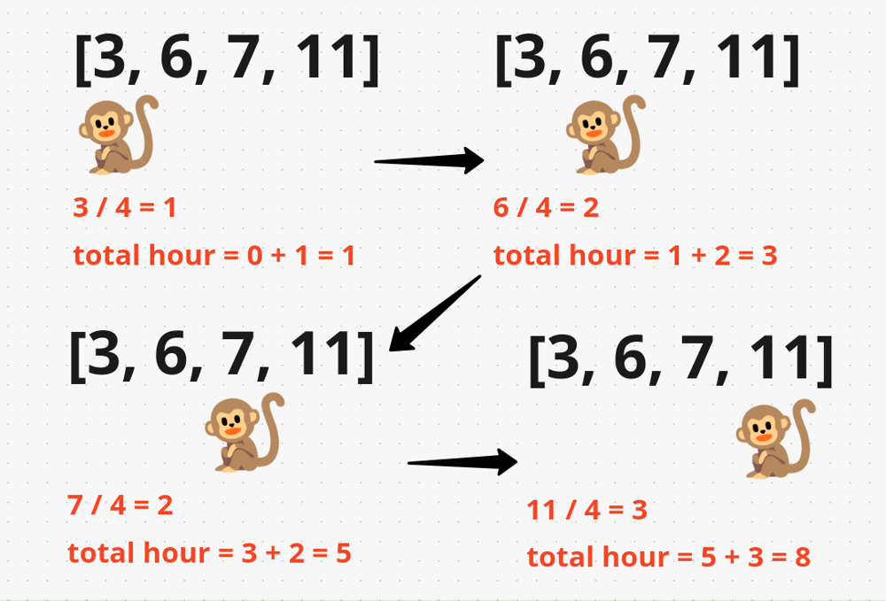

# BinarySearch


## Problem Name

*  Binary Search - Done
*  Floor in a Sorted Array - Done
*  Peak element - Done
*  Square root of a number - Done
*  Koko Eating Bananas - Done
*  Minimum days to make M bouquets 
*  Smallest Divisor 
*  Capacity To Ship Packages Within D Days 
*  Aggressive Cows 
*  Allocate minimum number of pages 
*  Median of 2 Sorted Arrays of Different Sizes 
*  Lower and Upper Bound 
*  Search Insert Position - Done
*  First and Last occurrence of a number - Done
*  Search in sorted rotated array 
*  Search in sorted rotated array II 
*  Min element in sorted rotated array - Done
*  Minimize max distance to gas station 
*  Capacity to ship packages within D days 
*  Median of 2 sorted arrays 
*  Nth root of a number 
*  Kth element of 2 sorted arrays 
*  Find Peak element II 
*  Find Median in row wise sorted array 
*  Search in row wise and column wise sorted array 
*  Matrix Median


#### note :
```text
in binary search why mid is calculated as low + (high-low) / 2 and not (low+ high) /2

Because if we use mid = (low + high)/2 then it might lead to overflow, as (high + low) can exceed range and will eventually lead to overflow. But if we use mid = low + (high - low)/2, then the possibility of overflow becomes none, as if high and low are in the range, then (high - low) will definitely be in range and will not overflow.

In binary search, the mid value is calculated as low + (high - low) / 2 to avoid integer overflow. Integer overflow occurs when the sum of two values exceeds the maximum value that can be represented by the data type. For example, if low is 2,147,483,647 and high is 1, then low + high = 2,147,483,648, which is greater than the maximum value for a 32-bit integer.
The formula low + (high - low) / 2 avoids integer overflow by subtracting low from high before dividing by 2. This ensures that the result is always less than or equal to high, regardless of the value of low.
Here is an example of how to calculate the mid value using both formulas:
low = 2,147,483,647
high = 1

// Using the formula low + (high - low) / 2
mid = low + (high - low) / 2
mid = 2,147,483,647 + (1 - 2,147,483,647) / 2
mid = 0

// Using the formula (low + high) / 2
mid = (low + high) / 2
mid = (2,147,483,647 + 1) / 2
mid = 2,147,483,648 
As you can see, the first formula results in a valid mid value, while the second formula results in an integer overflow.
```


### Binary Search 

```java
int binarysearch(int arr[], int n, int K) {
        int low=0, high=n-1;

        while(low<=high){
            int mid = (low + high )/2;
            if(arr[mid] == K){
                return mid;
            } else if(K > arr[mid]){
                low = mid+1;
            } else if(K< arr[mid]){
                high=mid-1;
            }
        }
        return -1;
    }
```

###  Floor in a Sorted Array

```text
Given a sorted array arr[] of size N without duplicates, and given a value x. Floor of x is defined as the largest element K in arr[] such that K is smaller than or equal to x. 
Find the index of K(0-based indexing).

Example 1:

Input:
N = 7, x = 0 
arr[] = {1,2,8,10,11,12,19}
Output: -1
Explanation: No element less 
than 0 is found. So output 
is "-1".

Idea : There is a catch in the problem, the given array is sorted. The idea is to use Binary Search to find the floor of a number x in a sorted array by comparing it
to the middle element and dividing the search space into half

The array is sorted in ascending order. This allows us to efficiently search for the floor using binary search, rather than scanning the array one element at a time.

When we look at the middle element of the array:
If the middle element is smaller than 
𝑥
x, it could be the floor, but we need to check if there’s a larger element (closer to 
𝑥
x) on the right side.
If the middle element is greater than 
𝑥
x, it cannot be the floor, so we move to the left side.
By narrowing down the search space this way, we can quickly find the floor.

```

```java
// TC : O(log n)
// SC: (1)
static int findFloor(long arr[], int n, long x)
    {
      int floorIndex = -1;
      int left = 0, right = n - 1;

        while (left <= right) {
            int mid = left + (right - left) / 2;

            if (arr[mid] <= x) {
                floorIndex = mid;
                left = mid + 1;
            } else {
                right = mid - 1;
            }
        }
        
        return floorIndex;
     
    }
```
*  First and last occurrences of X

### Peak element
```text

Given an 0-indexed array of integers arr[] of size n, find its peak element and return it's index. An element is considered to be peak if it's value is greater than or equal to the values of its adjacent elements (if they exist).
Note: The output will be 1 if the index returned by your function is correct; otherwise, it will be 0.
Example 1:
Input: 
n = 3
arr[] = {1, 2, 3}
Output: 
1
Explanation: 
If the index returned is 2, then the output printed will be 1. Since arr[2] = 3 is greater than its adjacent elements, and there is no element after it, we can consider it as a peak element. No other index satisfies the same property, so answer will be printed as 0.
Example 2:

Input:
n = 7
arr[] = {1, 1, 1, 2, 1, 1, 1}
Output: 
1
Explanation: 
In this case there are 5 peak elements with indices as {0,1,3,5,6}. Returning any of them will give you correct answer.

An element is considered as peak element if it is greater than its adjacent element or neighbours
https://takeuforward.org/data-structure/peak-element-in-array/
The naive solution would be to traverse the array linearly and check the condition if the 
element at i the index is greater than element ar i-1 and i+1 but here TC would O(n)

We can use binary search here The intuition is we find the mid element if it satisfies the condition of peak element return it
then we check for its adjacent element if any of the adjacent element is higher than mid element
we check in that half of the array. There can be multiple peak element we need find one
 
```

```java
// TC O(logn)
// SC O(n)
 public int findPeakElement(int[] arr) {
        int n = arr.length;
        int low = 0;
        int high = n-1;
        int mid = 0;
        while(low<=high){
            mid = low + (high-low) /2;
            if((mid ==0  || arr[mid-1]<arr[mid]) && (mid==n-1 || arr[mid+1]<arr[mid])){
                return mid;
            }
            if(mid >0 && arr[mid-1]>arr[mid]){
                high = mid-1;
            } else {
                low = mid+1;
            }
        }
        return mid;
    }
```


###  Square root of a number

```text
Finding Sqrt of a number using Binary Search (https://takeuforward.org/binary-search/finding-sqrt-of-a-number-using-binary-search/)
Problem Statement: You are given a positive integer n. Your task is to find and return its square root. 
If ‘n’ is not a perfect square, then return the floor value of 'sqrt(n)'.

Naive approach to solve this problem is to run a loop from 1 to n, each time iterating check if i*i <=n if so return i as as a sqrt
Time Complexity: O(N)
Space Complexity: O(1)

Algorithm:
The steps are as follows:

We will declare a variable called ‘ans’.

* Place the 2 pointers i.e. low and high: Initially, we will place the pointers. The pointer low will point to 1 and the high will point to n.
* Calculate the ‘mid’: Now, inside a loop, we will calculate the value of ‘mid’ using the following formula:
    mid = (low+high) // 2 ( ‘//’ refers to integer division)
* Eliminate the halves accordingly: 
    - If mid*mid <= n: On satisfying this condition, we can conclude that the number ‘mid’ is one of the possible answers. So, we will store ‘mid’ in the variable ‘ans’. But we want the maximum number that holds this condition. So, we will eliminate the left half and consider the right half(i.e. low = mid+1).
    - Otherwise, the value mid is larger than the number we want. This means the numbers greater than ‘mid’ will not be our answers and the right half of ‘mid’ consists of such numbers. So, we will eliminate the right half and consider the left half(i.e. high = mid-1).
* Finally, the ‘ans’ variable will be storing our answer. In addition to that, the high pointer will also point to the same number i.e. our answer. So, we can return either of the ‘ans’ or ‘high’.
The steps from 2-3 will be inside a loop and the loop will continue until low crosses high
Time Complexity: O(logN), N = size of the given array.
Reason: We are basically using the Binary Search algorithm.

Space Complexity: O(1) as we are not using any extra space.
```
```java
long floorSqrt(long x) {
        int low = 1;
		int high = (int)x;
		long ans =0;
		while(low<=high){
		    long mid = (low +high)/2;
		    long val = mid*mid;
		    if(val <= x){
		        ans = mid;
		        low = (int) mid+1;
		    } else {
		        high = (int)mid -1;
		    }
		}
		return ans;
	 }
```

###  Koko Eating Bananas
```text
https://leetcode.com/problems/koko-eating-bananas/description/

Example 1:

Input: piles = [3,6,7,11], h = 8
Output: 4
Example 2:

Input: piles = [30,11,23,4,20], h = 5
Output: 30
Example 3:

Input: piles = [30,11,23,4,20], h = 6
Output: 23

Brute force approach is to linear search the from 1 to max of piles of banana and find the min eating speed
the optimal approach is to use binary search 
TC O(log(max) * n)
SC O(1) 
```


```java
 public int minEatingSpeed(int[] piles, int h) {
        int low =0;
        int high = Arrays.stream(piles).max().getAsInt();
        int result = high;

        while(low<=high){
            int mid = (low+high)/2;

            if(canEatInHours(piles,h,mid)){
                high = mid-1;
                result = Math.min(result,mid);
            } else {
                low = mid +1;
            }
        }
        return result;
    }

    public boolean canEatInHours(int[] arr, int h, int tot){
        int time =0;
        for(int i=0;i<arr.length;i++){
            time += Math.ceil((double) arr[i]/tot);
        }
        return time<=h;
    }
```
*  Minimum days to make M bouquets
*  Smallest Divisor
*  Capacity To Ship Packages Within D Days
*  Aggressive Cows
*  Allocate minimum number of pages 

### Median of 2 Sorted Arrays of Different Sizes

```text
Given two sorted arrays of sizes N and M respectively. The task is to find the median of the two arrays when they get merged.
If there are even number of elements in the resulting array, find the floor of the average of two medians.
Example 1:
Input:
N = 5, M = 6 
arr[] = {1,2,3,4,5}
brr[] = {3,4,5,6,7,8}
Output: 4
Explanation: After merging two arrays, 
elements will be as 1 2 3 3 4 4 5 5 6 7 8
So, median is 4.

How to find the median:

- If the length of the merged array (n1+n2) is even: The median is the average of the two middle elements. index = (n1+n2) / 2, median = (arr3[index] + arr3[index-1]) / 2.0.
- If the length of the merged array (n1+n2) is odd: index = (n1+n2) / 2,
median = arr3[index].
- We will use a third array i.e. arr3[] of size (n1+n2) to store the elements of the two sorted arrays. 
    Now, we will take two pointers i and j, where i points to the first element of arr1[] and j points to the first element of arr2[].
    Next, using a while loop( while(i < n1 && j < n2)), we will select two elements i.e. arr1[i] and arr2[j], and consider the smallest one among the two. Then, we will insert the smallest element in the third array and increase that specific pointer by 1.
    If arr1[i] < arr2[j]: Insert arr1[i] into the third array and increase i by 1.
    Otherwise: Insert arr2[j] into the third array and increase j by 1.
- After that, the left-out elements from both arrays will be copied as it is into the third array.
- Now, the third array i.e. arr3[] will be the sorted merged array. Now the median will be the following:   
    If the length of arr3[] i.e. (n1+n2) is even: The median is the average of the two middle elements. index = (n1+n2) / 2, median = (arr3[index] + arr3[index-1]) / 2.0.
    If the length of arr3[] i.e. (n1+n2) is odd: index = (n1+n2) / 2,
    median = arr3[index].
- Finally, we will return the value of the median.
Time Complexity: O(n1+n2), where  n1 and n2 are the sizes of the given arrays.
Reason: We traverse through both arrays linearly.

Space Complexity: O(n1+n2), where  n1 and n2 are the sizes of the given arrays.
Reason: We are using an extra array of size (n1+n2) to solve this problem.
```

### Lower and Upper Bound (uing linear search)
```text
Given an unsorted array Arr[] of N integers and an integer X, find floor and ceiling of X in Arr[0..N-1].

Floor of X is the largest element which is smaller than or equal to X. Floor of X doesn’t exist if X is smaller than smallest element of Arr[].

Ceil of X is the smallest element which is greater than or equal to X. Ceil of X doesn’t exist if X is greater than greatest element of Arr[].

Example 1:

Input:
N = 8, X = 7
Arr[] = {5, 6, 8, 9, 6, 5, 5, 6}
Output: 6 8
Explanation:
Floor of 7 is 6 and ceil of 7 
is 8.

* Finding the Ceiling
Condition: if (arr[i] >= x && max > (arr[i] - x))
* This checks if the current array element arr[i] is greater than or equal to x and if the difference between arr[i] and x is less than the current max.
* If the condition is true, it means arr[i] is a closer ceiling value to x than any previously found value.
* Update: ceil = arr[i] and max = arr[i] - x
* The ceiling value ceil is updated to the current array element.
* The max variable is updated to the difference arr[i] - x to keep track of the closest ceiling found so far.
* Finding the Floor
*  Condition: if (arr[i] <= x && min > (x - arr[i]))
* This checks if the current array element arr[i] is less than or equal to x and if the difference between x and arr[i] is less than the current min.
* If the condition is true, it means arr[i] is a closer floor value to x than any previously found value.
* Update: floor = arr[i] and min = x - arr[i]
* The floor value floor is updated to the current array element.
* The min variable is updated to the difference x - arr[i] to keep track of the closest floor found so far.
```

```java
  Pair getFloorAndCeil(int[] arr, int n, int x) {
        // code here
        int floor =-1;
        int ceil =-1;
        
        int max = Integer.MAX_VALUE;
        int min = Integer.MAX_VALUE;
        
        for(int i=0;i<n;i++){
            
           if (arr[i] >= x && max > (arr[i] - x)) 
            { 
                ceil = arr[i]; 
                max = arr[i] - x; 
            } 
   
            
            if (arr[i] <= x && min > (x - arr[i])) 
            { 
                floor = arr[i]; 
                min = x - arr[i]; 
            } 
        }
        
        return new Pair(floor,ceil);
        
    }
```
```java
//using binary search
```
### Search Insert Position
```text
Given a sorted array of distinct integers and a target value, return the index if the target is found. If not, return the index where it would be if it were inserted in order.
You must write an algorithm with O(log n) runtime complexity.
Example 1:

Input: nums = [1,3,5,6], target = 5
Output: 2
Example 2:

Input: nums = [1,3,5,6], target = 2
Output: 1

if the element is not present, we have to find the nearest greater number of the target number. So, basically, we are trying to find an element arr[ind] >= x and hence the lower bound of the target number i.e. x.
The lower bound algorithm returns the first occurrence of the target number if the number is present and otherwise, it returns the nearest greater element of the target number.

TC O(logn)
SC O(1)
```

```java
 public static int searchInsert(int[] nums, int target) {
    int left = 0;
    int right = nums.length - 1;

    while (left <= right) {
        int mid = left + (right - left) / 2; // Prevents overflow

        if (nums[mid] == target) {
            return mid; // Target found
        } else if (nums[mid] < target) {
            left = mid + 1; // Target is in the right half
        } else {
            right = mid - 1; // Target is in the left half
        }
    }

    // If not found, left is the insertion point
    return left;
}

```


*  Sqrt(x)
### First and Last occurrence of a number
```text
Given a sorted array arr containing n elements with possibly some duplicate, the task is to find the first and last occurrences of an element x in the given array.
Note: If the number x is not found in the array then return both the indices as -1.


Example 1:

Input:
n=9, x=5
arr[] = { 1, 3, 5, 5, 5, 5, 67, 123, 125 }
Output:  
2 5
Explanation: 
First occurrence of 5 is at index 2 and last occurrence of 5 is at index 5

Brute force solution would be to use linear search first the first and last occurence and return it but TC will O(n)
We can use Binary Search to find the first and last occurence
TC O(log n)
SC O(1)
```

```java
public int[] searchRange(int[] nums, int target) {
        int[] result = new int[2];
        result[0] = findOccurrence(nums, target, true);
        result[1] = findOccurrence(nums, target, false);
        return result;
    }

   public static int findOccurrence(int[] nums, int target, boolean first){
        int low =0;
        int high = nums.length-1;
        int i =-1;
        while (low<=high){
            int mid = (low+high)/2;
            if(nums[mid]>target){
                high = mid -1;
            } else if(nums[mid]<target){
                low = mid +1;
            } else {
                i = mid;
                if(first == true){
                    high = mid-1;
                } else {
                    low = mid+1;
                }
            }
        }
        return i;
    }

```
### Search in sorted rotated array

```text
There is an integer array nums sorted in ascending order (with distinct values).

Prior to being passed to your function, nums is possibly rotated at an unknown pivot index k (1 <= k < nums.length) such that the resulting array is [nums[k], nums[k+1], ..., nums[n-1], nums[0], nums[1], ..., nums[k-1]] (0-indexed). For example, [0,1,2,4,5,6,7] might be rotated at pivot index 3 and become [4,5,6,7,0,1,2].

Given the array nums after the possible rotation and an integer target, return the index of target if it is in nums, or -1 if it is not in nums.

Example 1:

Input: nums = [4,5,6,7,0,1,2], target = 0
Output: 4
Example 2:

Input: nums = [4,5,6,7,0,1,2], target = 3
Output: -1
Example 3:

Input: nums = [1], target = 0
Output: -1

Intuition: Answer lies in one of the half. First we determine the half where the value will fall. Everytime we devide the half
we search if the target is the range of low - mid or if it is in the range of mid to high
TC O(logn)
SC O(1)
```

```java
 public int search(int[] nums, int target) {
        int n = nums.length;
        int low = 0;
        int high = n-1;

        while(low<=high){
            int mid = (low+high)/2;
            if(nums[mid]==target){
                return mid;
            }
            if(nums[low]<=nums[mid]){
                // check if the target is in the range of low - mid
                if(nums[low]<=target && target <= nums[mid]){
                    high = mid-1;
                } else {
                    low = mid +1;
                }
            } else {
                // check if the target is in the range of  mid - high
                if(nums[mid]<=target && target <= nums[high]){
                    low = mid+1;
                } else {
                    high = mid-1;
                }
            }
        }
        return -1;
    }
```

*  Search in sorted rotated array II
### Min element in sorted rotated array
```text
Given an array of distinct elements which was initially sorted. This array may be rotated at some unknown point. 
The task is to find the minimum element in the given sorted and rotated array. 

Example 1:

Input:
N = 10
arr[] = {2,3,4,5,6,7,8,9,10,1}
Output: 1
Explanation: The array is rotated 
once anti-clockwise. So minimum 
element is at last index (n-1) 
which is 1.
Example 2:

Input:
N = 5
arr[] = {3,4,5,1,2}
Output: 1
Explanation: The array is rotated 
and the minimum element present is
at index (n-2) which is 1.

The naive solution is to iterate the array and find the min element TC is O(N)
Another solution is to simply sort the array using Array.sort(arr) and return the arr[0] element O(logn)
Another solution is to use the binary search

following are the observations that can be used to solve this problem in 
1. in sorted rotated array the minimum element always appears after the max element. eg 1 is appearing before 1 
2,3,4,5,6,7,8,9,10,1
2. We check the sorted part of the array and eliminate that half because our answer always lies in the unsorted part 
5,6,7,8,[10,1,2],3,4
```

```java
public int findMin(int[] nums) {
    int low =0;
    int high = nums.length-1;
    if (nums[low] <= nums[high]) {
        return nums[low];
    } // if array is only sorted not rotated
    while(low<=high){
        if (high - low == 1) {
            return Math.min(nums[low], nums[high]);
        } // if there are only two elements in the array
        int mid = (low+high)/2;
        if(mid ==0 || nums[mid]<nums[mid-1]){
            return nums[mid];
        }
        if(nums[mid]< nums[high]){
            high = mid-1;
        } else {
            low = mid +1;
        }
    }

    return -1;
}
```

*  Find peak element in a mountain array
*  Minimize max distance to gas station
*  Capacity to ship packages within D days
*  Median of 2 sorted arrays
### Nth root of a number
```text
We can guarantee that our answer will lie between the range from 1 to m i.e. the given number. So, we will perform a linear search on this range and we will find the number x, such that
func(x, n) = m. If no such number exists, we will return -1.

Note: func(x, n) returns the value of x raised to the power n i.e. xn.

Optimal solution is using binary search O(log n)
```
```java
 public int NthRoot(int n, int m)
    {
      int low=1, high=m;

        while(low<=high){
            int mid = (low+high) /2;
            int pow = (int)Math.pow(mid, n);
            if(pow == m){
                return mid;
            } else if(pow>m){
                high = mid-1;
            } else {
                low = mid+1;
            }
        }
        return -1;
    }
    
```
*  Kth element of 2 sorted arrays
*  Find Peak element II
*  Find Median in row wise sorted array
*  Search in row wise and column wise sorted array
*  Matrix Median